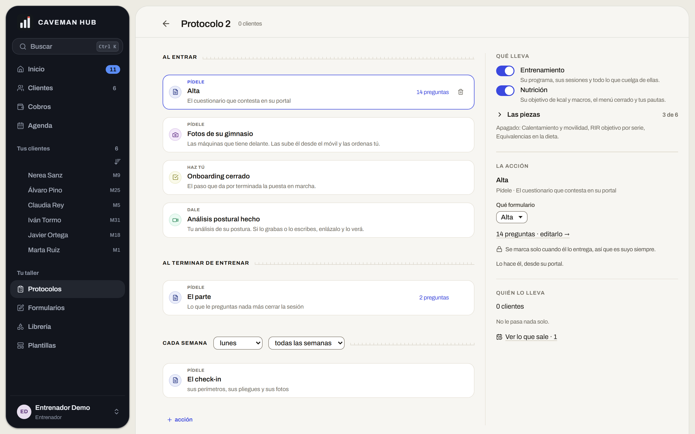
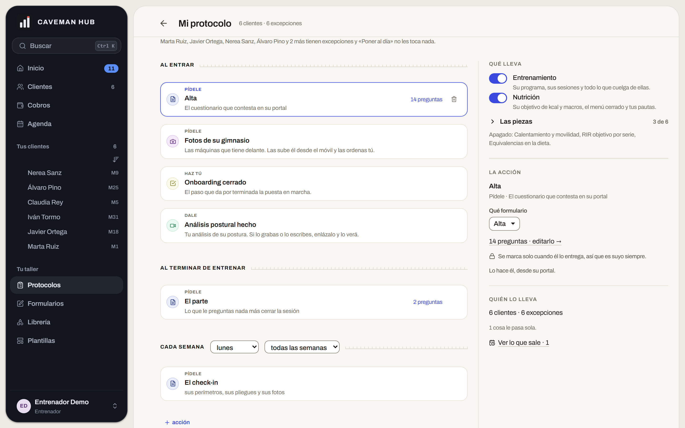
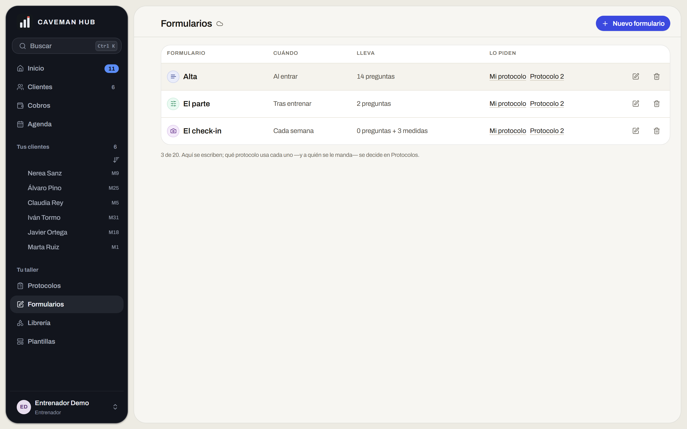

# Estudio «Un entrenador nuevo abre Protocolos»

*13 de septiembre de 2026. El encargo del dueño, literal: «en general que el
protocolo se haga como se hace actualmente lo veo un poco lío, está bien meter
en protocolo los formularios pero lo siento como muy confuso, incómodo para un
entrenador nuevo».*

*No se ha construido nada de lo que se propone aquí. Todo lo que se afirma está
medido contra la app corriendo en local con la demo puesta (Supabase local +
`npm run demo`, seis clientes, dos protocolos). Las capturas son de esa sesión.*

---

## 0. Qué se midió, y qué NO es este estudio

Esto no es un estudio del dibujo. La pantalla está bien dibujada: la rejilla
respira, los discos de color distinguen familias de acción y los antetítulos
—**PÍDELE**, **DALE**, **HAZ TÚ**, **AVÍSAME**— son de lo mejor escrito que hay
en la aplicación. Un entrenador nuevo no se pierde por cómo se ve.

Se pierde por **qué es cada cosa y dónde vive**. Eso es lo que se midió.

*«Protocolo 2», recién duplicado y sin nadie: lo más parecido a lo que ve quien
entra el primer día.*

---

## 1. Siete averías, con su evidencia

### A-1 · «CADA SEMANA … todas las semanas»

El rótulo de la premisa es «Cada semana» (`acciones.js:77`) y a tres píxeles hay
un `<select>` que dice «todas las semanas». Con cadencia de dos, la misma línea
lee **«CADA SEMANA · lunes · cada 2 semanas»**: una contradicción literal.

Y los dos desplegables van desnudos. El `aria-label` está puesto —el lector de
pantalla sí dice cuál es cuál— pero quien mira tiene que deducir qué gobierna
«lunes» por el contenido de la caja.

> Cómo debería leerse, en una frase y no en dos cajas:
> **Le pides el check-in los _lunes_, _cada 2 semanas_.**
> Con las dos palabras editables en su sitio, que es la gramática de la casa.

### A-2 · El panel de la derecha repite la tarjeta de la izquierda

Con «Alta» seleccionada, la tarjeta dice: *PÍDELE · Alta · El cuestionario que
contesta en su portal · 14 preguntas*. Y el panel, a la derecha: *LA ACCIÓN ·
Alta · Pídele · El cuestionario que contesta en su portal · Qué formulario
[Alta ▾] · 14 preguntas · editarlo →*.

Todo menos el desplegable es un calco. El panel **no añade, repite**: el único
dato nuevo es con qué formulario se cumple la acción. Un entrenador nuevo lee
dos veces lo mismo y da por hecho que se le escapa una diferencia.

### A-3 · «Las piezas» se describe por lo que está apagado

> **Las piezas** — 3 de 6
> *Apagado: Calentamiento y movilidad, RIR objetivo por serie, Equivalencias en
> la dieta.*

Un bloque plegado cuyo resumen es la lista de lo que **no** está puesto. Para
saber qué lleva hay que restar mentalmente. Es la misma falta que el producto ya
corrigió en otras pantallas: decir el estado, no su negativo.

### A-4 · «Ver lo que sale · 1» no es de este protocolo

Verificado en el código: `porSalir` cuenta **todos** los envíos pendientes de
toda la cartera (`ProtocolosPanel.jsx:211`), y se pinta dentro de la sección
**QUIÉN LO LLEVA**, justo debajo de «0 clientes» y «No le pasa nada solo».

O sea que un protocolo que no lleva nadie y al que no le pasa nada solo enseña,
en su propio panel, que hay una cosa a punto de salir. Las dos frases de arriba
son de este protocolo y la de abajo es de la casa entera. No es un matiz: es la
sección respondiendo a dos preguntas distintas sin avisar.

### A-5 · La primera línea de la pantalla es un reproche

Antes de la primera acción:

> *Marta Ruiz, Javier Ortega, Nerea Sanz, Álvaro Pino y 2 más tienen excepciones
> y «Poner al día» no les toca nada.*

Seis clientes, seis excepciones. **Cuando todos son la excepción, la excepción no
informa de nada** — y ocupa el primer renglón de la pantalla, escrito en
negativo («no les toca nada»), que es justo lo que la ley de la casa —«sin
reproches»— no quiere.

*(La proporción es de la demo y puede no ser la real. Lo que no depende de los
datos es el sitio: esa línea va antes que el trabajo.)*

### A-6 · Dos puertas para una sola partida, y la app lo admite por escrito

Al pie de la lista de formularios:

> *3 de 20. Aquí se escriben; qué protocolo usa cada uno —y a quién se le
> manda— se decide en Protocolos.*

Una pantalla que necesita una nota para explicar qué mitad del trabajo le toca
es una pantalla partida por donde no se debía. Y la costura se nota en el
código: editar el formulario de una acción navega a `/formularios` con un
`state.volver` escrito **a propósito para que el entrenador no se pierda**
(`ProtocolosPanel.jsx`, `irAEditar`). Cuando hay que programar el camino de
vuelta, el viaje sobraba.

La columna «LO PIDEN» de Formularios enlaza de vuelta a los protocolos. Las dos
puertas se pasan el trabajo la una a la otra.

### A-7 · Seis sustantivos inventados antes de tocar nada

Protocolo · acción · premisa · enchufe · formulario · plantilla.

Ninguno es gratuito —todos significan algo distinto y el código los usa con
precisión— pero **son seis conceptos nuevos entre abrir la puerta y montar la
primera cosa**, y en ningún sitio de la pantalla se dice qué es un protocolo.
Quien viene de Excel no tiene dónde agarrarse.

---

## 2. El diagnóstico: cuatro clases de cosa bajo un techo

Lo que hace que esta pantalla se sienta «un lío» no es ninguna de las siete
averías de arriba. Es que **el protocolo es cuatro cosas a la vez**, y solo una
de ellas es un protocolo:

| | Qué es | Dónde está hoy | ¿Es el protocolo? |
|---|---|---|---|
| **Alcance** | Qué servicios lleva esta persona | Panel → «Qué lleva» | No: es la relación comercial |
| **Comportamiento** | Cómo se comporta la app contigo | Panel → «Las piezas» | No: ni siquiera le pasa al cliente |
| **Acciones** | Pídele · Dale · Avísame, con su premisa | La columna central | **Sí. Esto es el protocolo** |
| **Administración** | Clientes, excepciones, poner al día, la cola | Cabecera + panel | No: es gestión de la cartera |

Tres de las cuatro compiten con la única que la pantalla promete en su nombre. Y
la que sí es el protocolo —la columna de acciones, con sus premisas y sus
verbos— es **la mejor parte**, la que el dueño no ha cuestionado ni una vez.

> El problema no es lo que la pantalla hace. Es lo que la pantalla **además**
> hace.

*(Una de las cuatro ya ha adelgazado: «De dónde recortas al ajustar» salió de
«Qué lleva» el 13 de septiembre. La ventana del reajuste recuerda ahora lo que
elijas. Era comportamiento, no alcance.)*

---

## 3. Tres formas de arreglarlo

No son excluyentes. **A + B** es el rediseño; **C** es el colchón para quien
llega.

### A · El protocolo es solo la línea de tiempo

Sale de esta pantalla todo lo que no ocurre en un momento:

- **El alcance** baja a la ficha del cliente, que es donde se sabe qué le has
  vendido a esa persona. (Ojo: hoy `services` ya es del cliente y no de la
  plantilla —está en `NOT_COMPARED_KEYS`—, así que el interruptor está en la
  pantalla equivocada **por partida doble**.)
- **Las piezas** se van a los ajustes del entrenador: son cómo se comporta la
  app, no lo que le pasa a nadie.
- **La administración** se queda en la cabecera y en la cartera.

Queda una columna limpia: *Al entrar · Al terminar de entrenar · Cada semana ·
Si pasa demasiado tiempo*. Un verbo y un sujeto por renglón, y nada más.

**Lo que cuesta:** mover tres bloques de sitio y decidir dónde aterriza cada
uno. Ninguno cambia de modelo — todos viven ya en `clientProtocol`.

**El riesgo:** el alcance es lo que más se toca al dar de alta a alguien. Si
baja a la ficha, hay que comprobar que el alta sigue siendo un solo recorrido.

### B · Una sola puerta

Formularios deja de ser puerta de navegación. Un formulario se edita **desde la
acción que lo usa**, en capa, sin cambiar de pantalla.

Es exactamente el movimiento que ya funcionó con Ejercicios + Alimentos → la
Librería: una puerta con el trabajo dentro en vez de dos que se llaman entre sí.

**Lo que cuesta:** poco, y ya está medio hecho. `ConstructorLibre` es un
componente completo que hoy se monta en `/formularios`; montarlo en una capa
sobre el protocolo es cambiar quién lo renderiza. El `state.volver` desaparece
en lugar de crecer.

**Lo que hay que decidir:** si los formularios sueltos —los que no cuelgan de
ningún protocolo— siguen necesitando una lista propia. Probablemente sí, pero
como tramo de «Lo que sale», no como puerta del taller.

**El riesgo:** un entrenador con veinte formularios pierde la vista de
conjunto. Se compensa con la lista dentro de la capa.

### C · Un alta guiada, la primera vez

Tres preguntas en lugar de una pantalla, y solo la primera vez:

1. **¿Qué le das?** — entrenamiento, dieta, las dos.
2. **¿Qué le pides, y cuándo?** — el alta, el check-in y su día.
3. **¿De qué te aviso?** — el silencio, los pesajes.

Después, la pantalla de siempre. Resuelve al que llega sin quitarle nada al que
ya tiene quince protocolos montados.

**Lo que cuesta:** es pantalla nueva, pero sin modelo nuevo: las tres preguntas
escriben claves que ya existen.

**El riesgo:** un asistente que se salta se convierte en un paso muerto. Tiene
que poder cerrarse y no volver.

---

## 4. Lo que yo haría, y en este orden

1. **Las siete averías de §1**, que son baratas y no discuten nada. La frase de
   la cita, el panel que repite, «las piezas» en positivo, la cifra global fuera
   del panel del protocolo, la línea de excepciones donde no estorbe.
2. **B, la puerta única**, que es la que más lío quita por lo que cuesta.
3. **A, la línea de tiempo**, que es el rediseño de verdad y conviene hacerlo
   con B ya puesto: mover bloques de sitio se decide mejor cuando la pantalla ya
   tiene su forma final.
4. **C, el alta guiada**, al final: guiar hacia una pantalla que todavía va a
   cambiar es escribir dos veces el mismo texto.

---

## 5. Lo que NO tocaría

- **Los verbos y las premisas.** *PÍDELE · DALE · HAZ TÚ · AVÍSAME* bajo *Al
  entrar · Al terminar de entrenar · Cada semana*. Se lee lo que le pasa a una
  persona, en orden. Es la idea buena de esta pantalla y todo lo demás debería
  organizarse alrededor de ella.
- **Que los formularios vivan en el protocolo.** El dueño lo dice y es correcto:
  el protocolo dice *cuándo* y el formulario dice *qué*, y separarlos fue el
  error. Lo que falla no es la idea, es que se ejecutó con dos puertas.
- **Los discos de color por familia.** Distinguen sin gritar y no gastan el
  acento, que sigue queriendo decir «esto se toca».
